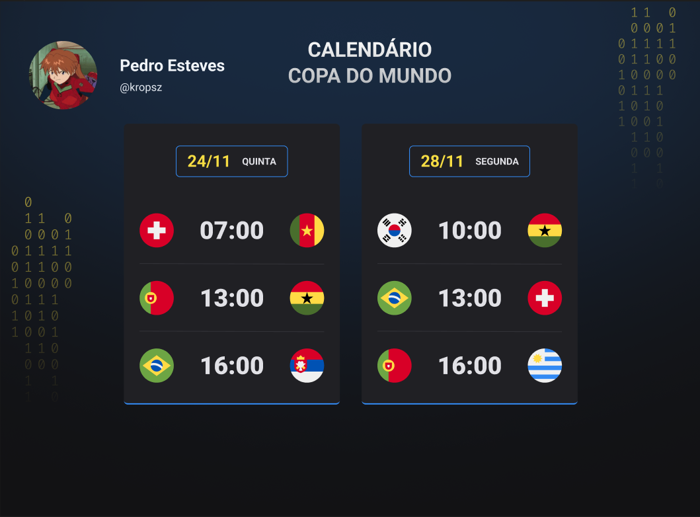

<h1: align="center"> World Cup Calendar</h1>

Evento promovido pela Rocketseat para ensino de tecnologias WEB.

<a href="#-tecnoleggias">Tecnologias</a>&nbsp;&nbsp;&nbsp;|&nbsp;&nbsp;&nbsp;
<a href="#-projeto">Projeto</a>&nbsp;&nbsp;&nbsp;|&nbsp;&nbsp;&nbsp;
<a href="#memo-licença">Licença</a>

 

## 👻 Tecnologias

Projeto foi desenvolvido utilizando as seguintes tecnologias:

- HTML e CSS
- JavaScript
- Git e GitHub

## 👨‍🎓 Projeto

O Calendário da Copa é um projeto para mostrar os jogos da Copa do Mundo de 2022

## 👨🏽‍💻 Licença
Esse projeto está sob a lincença MIT